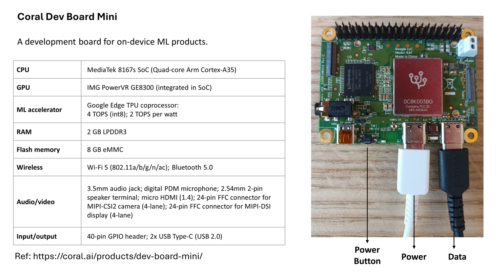

# Running deep learning auto-encoder models on embedded systems

## Introduction   
In this demo, we explain how to run ML models on embedded systems:      

1- Coral Dev Board Mini   

## Scripts description
### run_tflite.py
The "run_tflite.py" script demonstrates how to use a TensorFlow Lite (TFLite) model to perform inference on noisy test data.
The main steps are summarized by the following:   
1- Import the necessary libraries: "numpy", "tensorflow", and "os"   
2- Get the current path and combine it with the filenames to create the full path of the model and the data files   
3- Loads the data using "np.load"   
4- Loads the TFLite model and allocate tensors    
5- Gets the input and output details from the interpreter     
6- Converts the x_text_noisy data to np.float32 and stores them in text_data    
7- For each sample in the test data do the following:       
a- Reshape the sample to match the input tensor shape of the TFLite model      
b- Set the input and invoke inference      
c- Retreive the output and store in the results       
8- Convert the results into a Numpy array and store in another variable (decoded_layer)     
9- Print the decoded_layer (results of the inference)    
